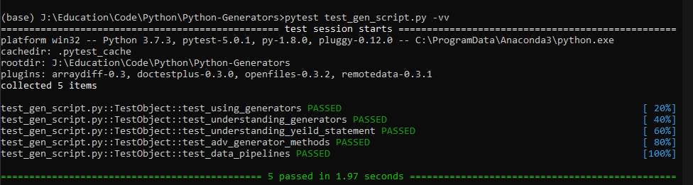

# Python-Generators

An exploration of the python generators by following the tutorial at: [How to Use Generators and yield in Python](https://realpython.com/introduction-to-python-generators/)

## Contents of the repository

The repository contains the following:

- All the original code
- Modifications to the code as part of my learning journey

## Sections

1. [x] Using Generators
   1. [x] Example 1: Reading Large Files
   2. [x] Example 2: Generating an Infinite Sequence
   3. [x] Example 3: Detecting Palindromes
2. [x] Understanding Generators
   1. [x] Building Generators With Generator Expressions
   2. [x] Profiling Generator Performance
3. [x] Understanding the Python Yield Statement
4. [x] Using Advanced Generator Methods
   1. [x] How to Use .send()
   2. [x] How to Use .throw()
   3. [x] How to Use .close()
5. [x] Creating Data Pipelines With Generators
6. [x] Conclusion

## Technologies Used

- Python Programming Language
  - Generators
  - Logging

## What I Have Learned

- [x] How to use and write generator functions and generator expressions
- [x] How the all-important Python yield statement enables generators
- [x] How to use multiple Python yield statements in a generator function
- [x] How to use .send() to send data to a generator
- [x] How to use .throw() to raise generator exceptions
- [x] How to use .close() to stop a generator’s iteration
- [x] How to build a generator pipeline to efficiently process large CSV files

## Images

## Future Scope

- Create a suit of applications with only generators
- Build applications without continous state or asynchromous outputs

## Project Output

    appLogger - 2020-03-15 14:09:41,305-8356-INFO-Row count is 1461 in reading_large_files1
    appLogger - 2020-03-15 14:09:41,307-8356-INFO-Row count is 1461 in reading_large_files2
    appLogger - 2020-03-15 14:09:41,308-8356-INFO-Row count is 1461 in reading_large_files3
    appLogger - 2020-03-15 14:09:41,309-8356-INFO-Infinite sequence nums = 0  1  2  3  4  5  6  7  8  9  10  11  12  13  14  15  16  17  18  19  20  21  22  23  24  25  26  27  28  29  30  31  32  33  34  35  36  37  38  39  40  41  42  43  44  45  46  47  48  49  50  51  52  53  54  55  56  57  58  59  60  61  62  63  64  65  66  67  68  69  70  71  72  73  74  75  76  77  78  79  80  81  82  83  84  85  86  87  88  89  90  91  92  93  94  95  96  97  98  99  100  101  102  103  104  105  106  ....... 989  990  991  992  993  994  995  996  997  998  999  
    appLogger - 2020-03-15 14:09:41,309-8356-INFO-Second infinite sequence = 0  1  2  3  4  5  6  7  8  9  10  11  12  13  14  15  16  17  18  19  20  21  22  23  24  25  26  27  28  29  30  31  32  33  34  35  36  37  38  39  40  41  42  43  44  45  46  47  48  49  50  51  52  53  54  55  56  57  58  59  60  61  62  63  64  65  66  67  68  69  70  71  72  73  74  75  76  77  78  79  80  81  82  83  84  85  86  87  88  89  90  91  92  93  94  95  96  97  98  99  100  101  102  103  104  105  106  ....... 989  990  991  992  993  994  995  996  997  998  999  
    appLogger - 2020-03-15 14:09:41,721-8356-INFO-Palindrome number sequence: 11  22  33  44  55  66  77  88  99  101  111  121  131  141  151  161  171  181  191  202  212  222  232  242  252  262  272  282  292  303  313  323  333  343  353  363  373  383  393  404  414  424  434  444  454  464  474  484  494  505  515  525  535  545  555  565  575  585  595  606  616  626  636  646  656  666  676  686  696  707  717  727  737  747  757  767  777  787  797  808  818  828  838  848  858  868  878  888  898  909  919  929  939  949  959  969  979  989  999  1001  1111  1221  1331  ........ 99099  99199  99299  99399  99499  99599  99699  99799  99899  99999  100001  101101  102201  
    appLogger - 2020-03-15 14:09:41,722-8356-INFO-type of nums_squared_lc:\<class 'list'>
    appLogger - 2020-03-15 14:09:41,722-8356-INFO-type of nums_squared_gc:\<class 'generator'>
    appLogger - 2020-03-15 14:09:41,796-8356-INFO-size of lc:87624
    appLogger - 2020-03-15 14:09:41,797-8356-INFO-size of gc:120
    appLogger - 2020-03-15 14:09:41,881-8356-INFO-Number of function calls for lc: 5
    appLogger - 2020-03-15 14:09:41,894-8356-INFO-Number of function calls for gc: 10005
    appLogger - 2020-03-15 14:09:41,894-8356-ERROR-Stop Iteration error: generator exhausted
    appLogger - 2020-03-15 14:09:41,894-8356-INFO-['This is the first string', 'This is the second string']
    appLogger - 2020-03-15 14:09:43,581-8356-INFO-[11, 111, 1111, 10101, 101101, 1001001, 10011001, 100010001, 1000110001, 10000100001]
    appLogger - 2020-03-15 14:09:43,582-8356-ERROR-ValueError exception thrown by generator
    appLogger - 2020-03-15 14:09:43,582-8356-INFO-[11, 111, 1111, 10101]
    appLogger - 2020-03-15 14:09:43,583-8356-ERROR-StopIteration exception thrown by generator
    appLogger - 2020-03-15 14:09:43,583-8356-INFO-[11, 111, 1111, 10101]
    appLogger - 2020-03-15 14:09:43,614-8356-INFO-Total series A fundraising : $4376015000
    appLogger - 2020-03-15 14:09:43,620-8356-INFO-Number of companies:563
    appLogger - 2020-03-15 14:09:43,620-8356-INFO-Average amount raised by company = 7772673

## Project Status

Project is completed.

## About The Project Repository

### Commit Style

- Use the imperative mood in the subject line
- Do not end the subject line with a period
- Use the body to explain what and why vs. how

### Folder Structure

All files are in a single folder.
